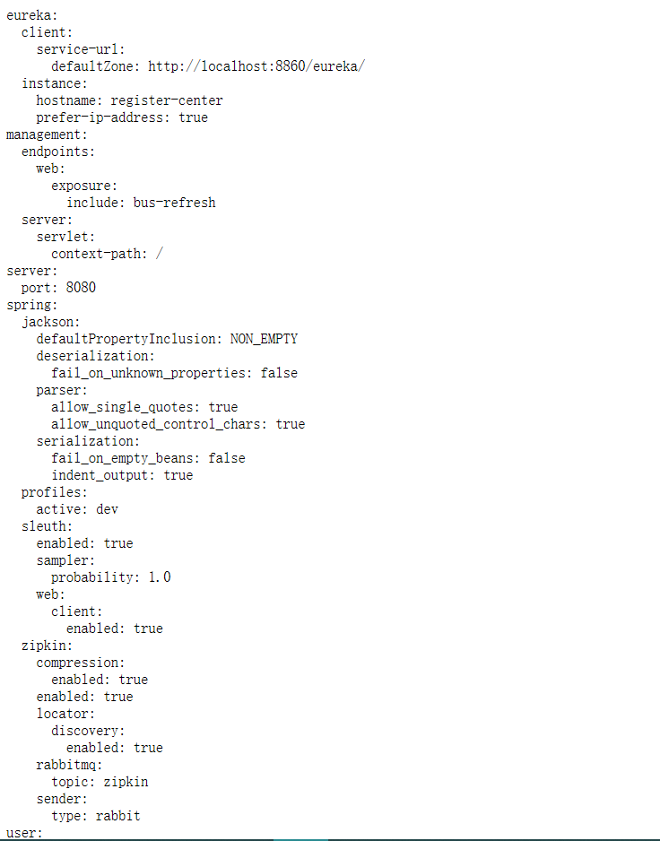
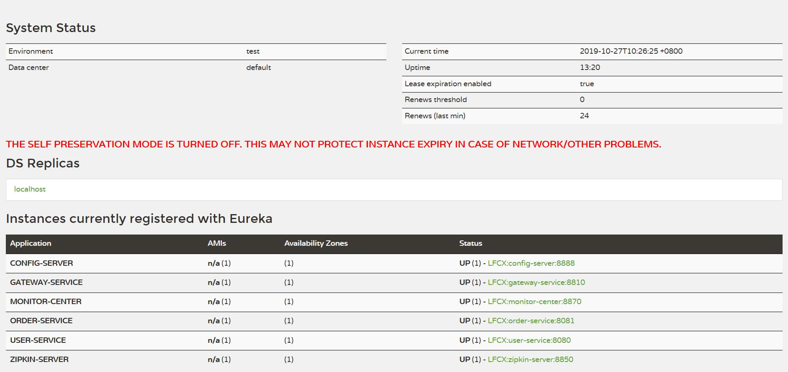
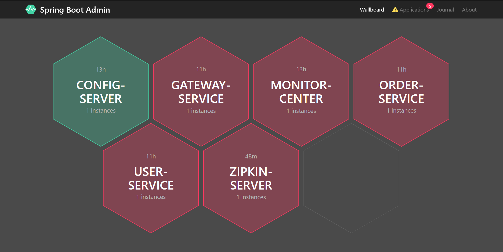
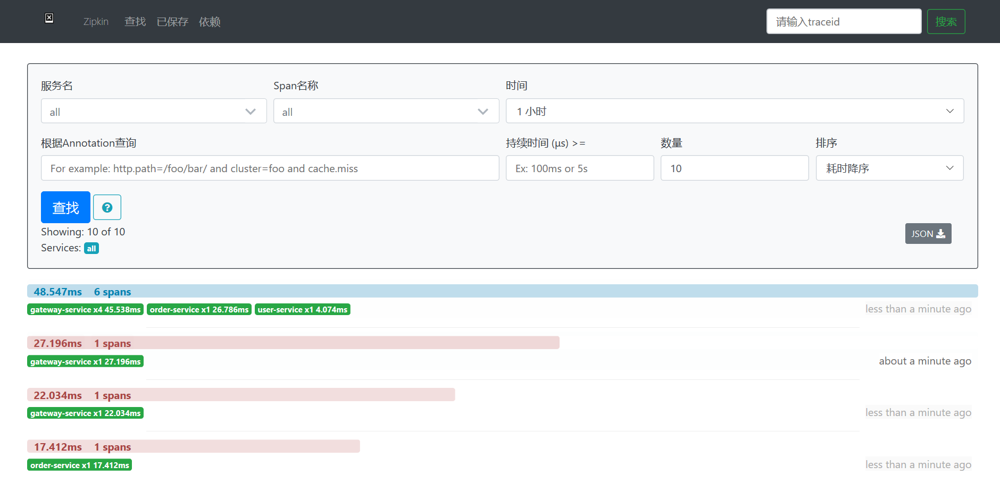
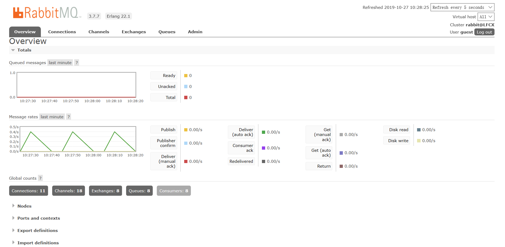

Spring Cloud 实例程序(Greenwich.SR3)
===

#### 项目说明
a demo of spring cloud with version Greenwich.SR3, include config, registry, monitor, gateway, zipkin, auth.

#### 项目结构
1. config-server(8888) 配置中心，集成了消息总线自动刷新 client 配置
    - config monitor(config server)
        - cloud bus:rabitmq
    - eureka client
2. zippkin-server(8850) 链路跟踪服务
    - zippkin server
    - eureka client
    - config client
    - cloud bus:rabitmq
    - elasticsearch(<6.0.0 版本)
3. register-center(8860) 服务注册中心
    - eureka server
      - ribbon
      - archaius
4. monitor-center(8870) 应用监控中心
    - spring boot admin
    - eureka client
    - config client
        - cloud bus:rabitmq
5. gateway-service(8810) 应用网关服务
6. auth-service(8820) 安全权限服务
7. custom-services 应用服务
    1. common-service 应用服务通用组件
    2. user-service(8080) 客户应用服务
       - config client
           - cloud bus:rabitmq
       - eureka client
    3. order-service(8081) 订单应用服务
       - config client
           - cloud bus:rabitmq
       - eureka client
       - feign
8. config-repo 配置文件仓库
9. project-notes 项目笔记

    
#### 项目部署
1. 环境配置
    - 安装 jdk11 以上版本
    - [安装 rabbitmq](project-notes/RabbitMq Install.MD) 
    - 安装 elasticsearch 6.0.0 以下版本([ES 镜像](https://thans.cn/mirror/elasticsearch.html), 下载 zip 包，开箱即用) 
2. 按顺序启动项目
    - register-center
    - config-server
    - monitor-center
    - zipkin-server
    - gateway-service
    - user-service
    - order-service
3. 通过网关访问 http://localhost:8810/order-service/order/user
    - **config-server** http://localhost:8888/user-service-dev.yml
    
    - **register-center** http://localhost:8860/
    
    - **monitor-center** http://localhost:8870/#/wallboard
    
    - **zipkin-sever** http://localhost:8850/zipkin
    
    - **rabbitmq** http://localhost:15672
    

2. 项目架构

#### 组件介绍

#### 参考教程
1. [配置中心自动刷新](https://blog.csdn.net/wtdm_160604/article/details/83720391)
2. [Spring Cloud 微服务架构](https://www.cnblogs.com/edisonchou/p/java_spring_cloud_foundation_sample_list.html)
3. [Spring Cloud 组件介绍](https://www.jianshu.com/p/d5a69eecbfb2)                     

#### 参考项目
1. [pig4cloud.com / pig](https://gitee.com/log4j/pig)
2. [changhe626/micro-service](https://github.com/changhe626/micro-service)
3. [zhangxd1989/spring-boot-cloud](https://github.com/zhangxd1989/spring-boot-cloud)
4. [spring-cloud-samples/brewery](https://github.com/spring-cloud-samples/brewery)
5. [hope-for/hope-cloud](https://github.com/hope-for/hope-cloud)

