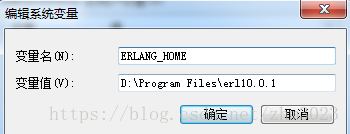
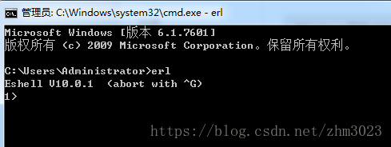

RabbitMq 安装配置
===

#### 1. 安装文件下载

1. [Erlang](https://www.erlang.org/downloads)
    - Erlang is the runtime of rabbitmq
2. [RabbitMq](https://www.rabbitmq.com/download.html)

#### 2. Erlang 安装配置

    1. 双击安装文件直接安装
    2. 设置环境变量 ERLANG_HOME


    3. 将 %ERLANG_HOME%\bin 添加到环境变量 path 中
    4. 执行命令 erl.exe 检查 erlang 是否运行正常

    
    5. 检查成功后关闭 erlang 进程
    
#### 3. rabbitmq 安装配置

    1. 解压缩安装包
    1. 设置环境变量 RABBITMQ_SERVER


    2. 将 %RABBITMQ_SERVER%\sbin 添加到环境变量 path 中
    3. 执行下面的命令安装插件
```text
rabbitmq-plugins.bat enable rabbitmq_management
```

#### 4. 运行 rabbitmq
    1. 命令行执行如下命令
```text
rabbitmq-server.bat
```
    2. 在浏览其中打开 http://localhost:15672 , 用户名/密码输入 guest/guest

        
### issues
1. 提示“目录名称无效。 文件名、目录名或卷标语法不正确。”
    - 计算机名为中文，将计算机名改成英文并重启电脑