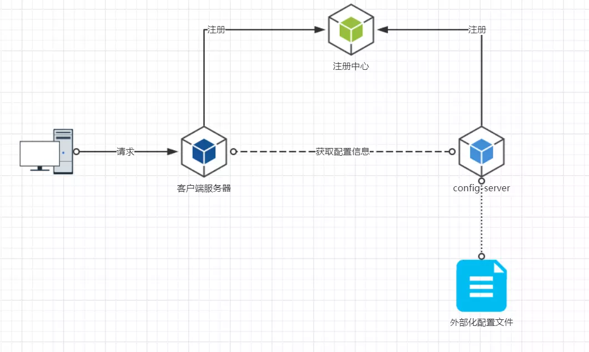

Spring Cloud Config 项目统一配置中心
===

### **项目配置**
#### **Config Server 项目配置**
1. 核心依赖
    ```xml
    <dependency>
        <groupId>org.springframework.cloud</groupId>
        <artifactId>spring-cloud-config-server</artifactId>
    </dependency>
    ```
1. 程序入口标注 @EnableConfigServer
    ```java
    @SpringBootApplication
    @EnableConfigServer
    @EnableDiscoveryClient
    public class ConfigServerApplication {
    
        public static void main(String[] args) {
            SpringApplication.run(ConfigServerApplication.class, args);
        }
    
    }
    ```
2. application.yml 中文件仓库配置
    ```text
    spring:
      cloud:
        config:
          server:
            git: # 配置中心文件位置
              uri: https://github.com/20087843/spring-cloud-demo
              search-paths: config-repo #
              force-pull: true #强制拉取
              delete-untracked-branches: true #删除无关分支
    ```
   
#### **config client 项目配置**
1. 核心依赖
    ```xml
    <dependency><!--配置中心客户端-->
        <groupId>org.springframework.cloud</groupId>
        <artifactId>spring-cloud-config-client</artifactId>
    </dependency>
    ```
2. application.yml 中config server 配置
    ```text
    spring:
      cloud:
        config: #从配置中心拉取配置文件，远程文件名格式 {app-name}-{profile}.yml
          enabled: true #启用config配置
          uri: http://localhost:8888/ #配置中心地址
          profile: dev
          label: master #从 master 分支拉取
          discovery:
            enable: true
            service-id: config-server #Config Server端的服务名字，不能瞎写
    ```
   
### 配置消息总线实现 config client 配置文件自动刷新

### Spring Cloud Config 介绍
Spring Cloud Config为分布式系统中的外部配置提供服务器和客户端支持。方便部署与运维。
- 集中管理配置文件
- 不同环境不同配置，动态化的配置更新
- 运行期间，不需要去服务器修改配置文件，服务会想配置中心拉取自己的信息
- 配置信息改变时，不需要重启即可更新配置信息到服务
- 配置信息以 rest 接口暴露

#### 架构图
