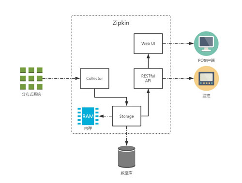

Zipkin Server 链路跟踪服务
===

### Zipkin 架构

Zipkin 主要有4个核心组件构成：
- Collector：收集器组件，它主要用于处理从外部系统发送过来的跟踪信息，将这些信息转换为Zipkin内部处理的Span格式，以支持后续的存储、分析、展示等功能。
- Storage：存储组件，它主要对处理收集器接收到的跟踪信息，默认会将这些信息存储在内存中，我们也可以修改此存储策略，通过使用其他存储组件将跟踪信息存储到 数据库 中。
- RESTful API：API组件，它主要用来提供外部访问接口。比如给客户端展示跟踪信息，或是外接系统访问以实现监控等。
- Web UI：UI组件，基于API组件实现的上层应用。通过UI组件用户可以方便而有直观地查询和分析跟踪信息。
#### Zipkin 工作原理
Zipkin分为两端，一个是Zipkin服务端，一个是Zipkin客户端，客户端也就是微服务应用。客户端会配置服务端的URL地址，一旦发生服务间的调用时，会被配置在微服务里面的Sleuth监听器监听，并生成相应的Trace和Span信息发送给服务端。发送的方式主要有两种，一种是HTTP报文的方式，另一种是消息总线的方式如RabbitMQ。
#### Zipkin 特性
- 供了可插拔数据存储方式：In-Memory（默认）、MySql、Cassandra 以及 Elasticsearch。

### Sleuth
#### Sleuth术语
- Span - Span是基本的工作单元。Span包括一个64位的唯一ID，一个64位trace码，描述信息，时间戳事件，key-value 注解(tags)，span处理者的ID（通常为IP）。 每个trace中会调用若干个服务，为了记录调用了哪些服务，以及每次调用的消耗时间等信息，在每次调用服务时，埋入一个调用记录，称为一个span。
- Trace - 包含一系列的span，它们组成了一个树型结构。从客户发起请求（request）抵达被追踪系统的边界开始，到被追踪系统向客户返回响应（response）为止的过程，称为一个 trace。
- Annotation - 用于及时记录存在的事件。常用的Annotation如下：
    - cs - Client Sent：客户端发送一个请求，表示span的开始
    - sr - Server Received：服务端接收请求并开始处理它。(sr-cs)等于网络的延迟
    - ss - Server Sent：服务端处理请求完成，开始返回结果给服务端。(ss-sr)表示服务端处理请求的时间
    - cr - Client Received：客户端完成接收返回结果，此时span结束。(cr-sr)表示客户端接收服务端数据的时间
#### Sleuth的用途：
- 耗时分析: 通过Sleuth可以很方便的了解到每个采样请求的耗时，从而分析出哪些服务调用比较耗时;
- 可视化错误: 对于程序未捕捉的异常，可以通过集成Zipkin服务界面上看到;
- 链路优化: 对于调用比较频繁的服务，可以针对这些服务实施一些优化措施。

### 参考资料
1. [spring cloud分布式整合zipkin的链路跟踪](https://www.cnblogs.com/itgaofei/p/9353054.html)
2. [springcloud+zipkin实现链路监控](https://blog.csdn.net/yangchuanan/article/details/83549345)
3. [Zipkin和微服务链路跟踪](https://cloud.tencent.com/developer/article/1082821)
4. [服务链路追踪（sleuth+zipkin）](https://www.cnblogs.com/lifeone/p/9040336.html)

### 参考项目
1. [pig-zipkin](https://gitee.com/log4j/pig/tree/master/pig-visual/pig-zipkin)